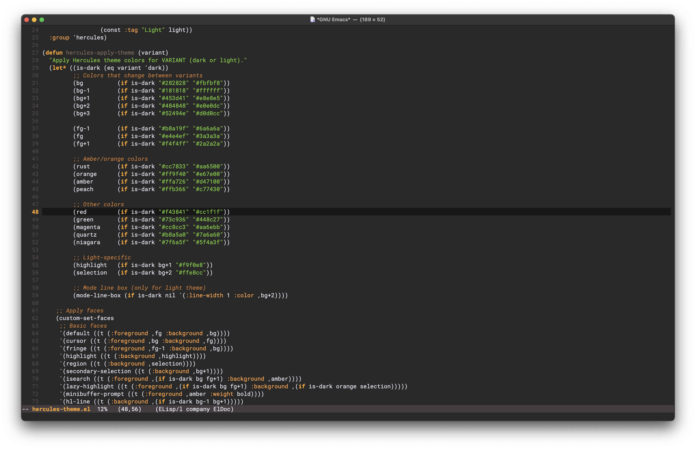
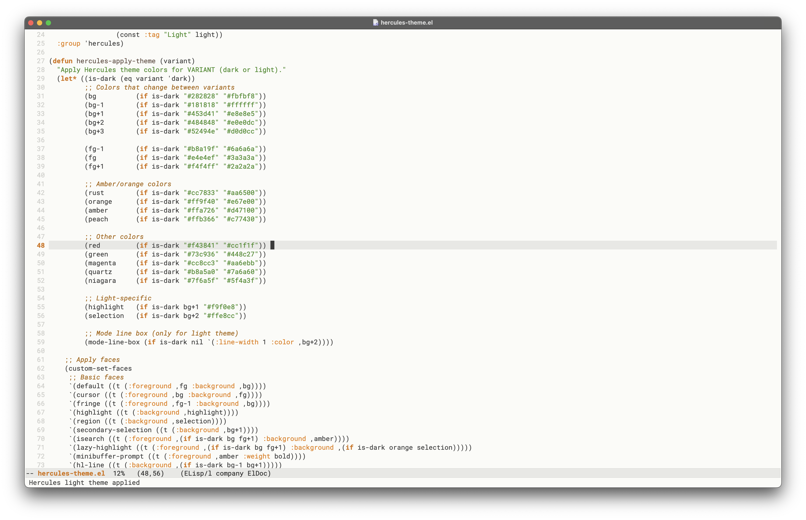

# Hercules Theme for Emacs

A minimalist theme for Emacs inspired by the amber Hercules monitors. The basis for this theme is `gruber-darker`.

## Usage
There are two ways to install this package. The first is the manual way and the second is to use `use-package`.

### Manual
Place `hercules-theme.el` in a directory in your load path and `require` it. By default the dark variant will be applied.

**Example:**

```elisp
(add-to-list 'load-path "~/.emacs.d/themes/")
(require 'hercules-theme)
```
Use `hercules-select-theme` to choose between dark and light variants. `hercules-toggle-theme` toggles between them.
```elisp
(hercules-select-theme 'dark)
(hercules-select-theme 'light)
(hercules-toggle-theme)
```

### Use package

With Emacs 31, you can install directly from github:

```elisp
(use-package hercules-theme
  :vc (:url "https://github.com/0xcefaedfe/hercules-theme" :rev :newest))
```

## Screenshots




## License

This theme is free software; you can redistribute it and/or modify it under the terms of the GNU General Public License as published by the Free Software Foundation; either version 3, or (at your option) any later version.
n

See [LICENSE](LICENSE) for details.
